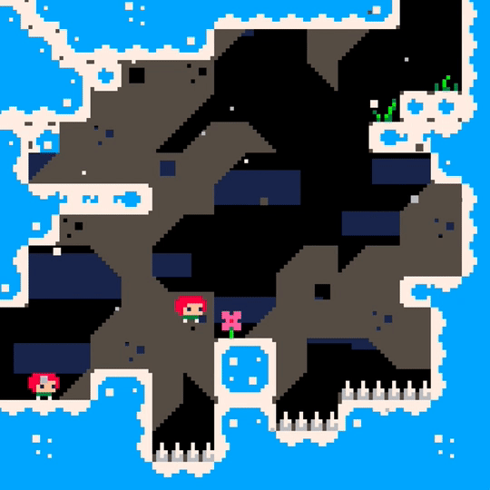

# Celeste

A port of Celeste classic to Crystal using CrSFML.

## Roadmap

- [X] Display map
- [ ] Load bottom half of the map.
- [X] Load Sprite flags.
- [X] Make collision with player work.
- [X] Make spikes work.
- [ ] Player controls: jump.
- [ ] Player controls: dash.
- [ ] Dying.
- [ ] Navigation between levels.
- [ ] Moving platforms. 

## Installation

- Install [Crystal](https://crystal-lang.org/)
- Install [CrSFML](https://github.com/oprypin/crsfml)
- Add a symbolic link to CrSFML and its dependencies (VoidCSFML) to `lib/` (optiona; needed for the `run` script)

## Usage

`./run src/celeste.cr` runs the game.

## Contributing

1. Fork it ( https://github.com/sherjilozair/celeste/fork )
2. Create your feature branch (git checkout -b my-new-feature)
3. Commit your changes (git commit -am 'Add some feature')
4. Push to the branch (git push origin my-new-feature)
5. Create a new Pull Request

## Contributors

- [sherjilozair](https://github.com/sherjilozair) Sherjil Ozair - creator, maintainer
